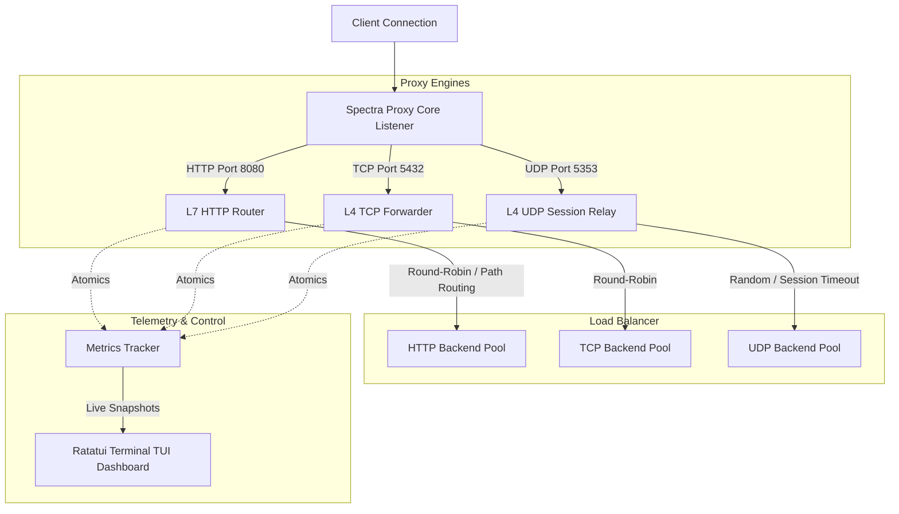

# ⚡ Spectra Proxy

Spectra Proxy is an ultra-fast, highly-concurrent, multi-threaded reverse proxy written in **Rust** from the ground up. It seamlessly bridges Layer 4 and Layer 7 networks by combining **TCP forwarding**, **UDP session relaying**, and **L7 HTTP routing** into a single, light-weight, and highly-performant daemon. 

It comes with an **interactive real-time terminal user interface (TUI)** dashboard powered by **Ratatui**, as well as full support for **SSL/TLS termination** (HTTPS and Secure TCP).

---

## ✨ Features

*   **Multi-Protocol Support**: Run L4 TCP forwarding, L4 UDP session-based mapping, and L7 HTTP proxying simultaneously.
*   **L7 HTTP/3 (QUIC) Support**: Full support for UDP-based HTTP/3 over QUIC using `quinn` and `h3` next to HTTP/1.x and HTTP/2. Automatic `Alt-Svc` headers advertise HTTP/3 dynamically to browsers on TCP HTTPS ports, allowing automatic connection upgrades.
*   **🛡️ Connection Rate Limiting (Token Bucket Middleware)**: High-performance Nginx-style token bucket rate limiting executed immediately at the socket layer. Rejects connection floods per source IP address before spawning background tasks or completing expensive TLS/QUIC handshakes.
*   **🔒 Dynamic Let's Encrypt Integration (ACME)**: Dynamic zero-configuration SSL/TLS certificate acquisition and automatic background renewals using the TLS-ALPN-01 protocol via `rustls-acme`. Keeps certificates fresh with persistent disk caching.
*   **🔌 High-Availability Circuit Breaker**: Dynamic fail-fast state machine protecting downstream applications. Temporarily trips off failing backend nodes (Closed -> Open) on consecutive packet/connection errors and gracefully checks recovery using probe requests (Half-Open).
*   **Zero-Downtime Hot Reloading**: Update, add, or remove proxy rules on the fly! Spectra Proxy automatically watches `config.toml` for changes (and intercepts standard UNIX `SIGHUP` signals), gracefully canceling port listeners while permitting active data streams to finish processing uninterrupted in the background.
*   **Interactive Terminal TUI Dashboard**: A gorgeous, real-time dark-themed console dashboard powered by `ratatui` and `crossterm` serving active connections, total connections, request counts, network throughput (bytes rx/tx), and error states.
*   **SSL/TLS Termination (HTTPS & TCPS)**: Full SSL/TLS support utilizing the modern, pure-Rust `tokio-rustls` engine. Easily bind secure endpoints by providing `cert_path` and `key_path` inside `config.toml`.
*   **L7 HTTP Routing**: Route requests based on host/paths (safely sorted by specificity so longer paths match first), inject proxy headers (e.g., `X-Forwarded-For`, `X-Forwarded-Proto`), and strip unwanted headers.
*   **Self-Cleaning UDP Session Engine**: Lock-free session associations mapping clients to backend sockets with an automatic self-terminating 30-second idle timeout sweep.
*   **Lock-Free Load Balancing**: Optimized Round-Robin and Random backend selectors utilizing high-speed atomic primitives.
*   **Smart Initializer**: The daemon automatically checks and writes a fully commented template `config.toml` upon startup if no configuration is present.
*   **Graceful Shutdown**: Pressing `q` or `Q` cleanly disables raw terminal modes, restores the alternate screen, and shuts down all active background socket listeners safely.

---

## 🏗️ Architecture



---

## 🛠️ Tech Stack

*   **Runtime**: [Tokio](https://tokio.rs/) (asynchronous multi-threaded engine)
*   **TUI Dashboard**: [Ratatui](https://ratatui.rs/) & [Crossterm](https://github.com/crossterm-rs/crossterm)
*   **SSL/TLS Termination**: [Tokio-Rustls](https://github.com/rustls/tokio-rustls) & [Rustls Pemfile](https://github.com/rustls/pemfile)
*   **HTTP/3 Engine**: [Quinn 0.11](https://github.com/quinn-rs/quinn) (QUIC protocol) & [H3 0.0.8](https://github.com/hyperium/h3) (HTTP/3 implementation)
*   **Dynamic Let's Encrypt (ACME)**: [Rustls-ACME 0.10](https://github.com/rustls/rustls-acme) (zero-configuration certificate management)
*   **HTTP Engine**: [Hyper v1.0](https://hyper.rs/) (industry-standard, lightning-fast parser)
*   **Serialization**: [Serde](https://serde.rs/) & [TOML](https://github.com/toml-rs/toml)
*   **CLI**: [Clap v4](https://github.com/clap-rs/clap) (modern CLI parser)
*   **Logging**: [Tracing](https://github.com/tokio-rs/tracing) (async-aware structured logging)

---

## 🚀 Quick Start

### 1. Build and Run
Clone the repository and run Cargo in release mode:
```bash
git clone https://github.com/Fantros/spectra-proxy.git
cd spectra-proxy
cargo run --release
```

### 2. Configuration Setup
Upon the first run, Spectra Proxy will detect that `config.toml` is missing and automatically create a beautiful default configuration for you:

```toml
# ==========================================
# Spectra Proxy Configuration File (TOML)
# Modern, High-Performance Multi-Protocol Proxy
# ==========================================

# List of Proxy Services

# 1. L7 HTTP Reverse Proxy with Path-based routing and Header modifications
[[services]]
name = "web-http-service"
protocol = "http"
listen_addr = "127.0.0.1:8080"
backends = ["127.0.0.1:8081", "127.0.0.1:8082"]
load_balance = "round_robin"
# cert_path = "cert.pem" # Uncomment and specify to enable HTTPS termination
# key_path = "key.pem"

[services.http_rules]
routes = [
    { path = "/api/v1", backends = ["127.0.0.1:8083"] },
    { path = "/", backends = ["127.0.0.1:8081", "127.0.0.1:8082"] }
]
[services.http_rules.headers]
inject = { "X-Proxy-Provider" = "SpectraProxy", "X-Environment" = "Production" }
remove = ["Server", "X-Powered-By"]

# 2. L4 TCP Reverse Proxy (Load-Balanced Postgres example)
[[services]]
name = "database-tcp-service"
protocol = "tcp"
listen_addr = "127.0.0.1:5432"
backends = ["127.0.0.1:5433", "127.0.0.1:5434"]
load_balance = "round_robin"
# cert_path = "cert.pem" # Uncomment and specify to enable TLS termination for TCP
# key_path = "key.pem"

# 3. L4 UDP Reverse Proxy (DNS relay example)
[[services]]
name = "dns-udp-service"
protocol = "udp"
listen_addr = "127.0.0.1:5353"
backends = ["8.8.8.8:53", "1.1.1.1:53"]
load_balance = "random"
```

### 3. Navigation inside TUI
When running in interactive mode:
*   Press **`q`** or **`Q`** at any time to cleanly exit the proxy and restore your terminal interface.
*   System logs will be automatically appended to `spectra-proxy.log` in the local workspace directory so they don't corrupt the terminal display.

---

## ⚡ Zero-Downtime Hot Reloading

Spectra Proxy supports seamless configuration hot reloads. You can update any proxy rules, bind new ports, change backend target lists, or configure TLS certificates on the fly without stopping the proxy.

### How to trigger a reload:
1.  **Automatic File Watching**: Simply modify and save `config.toml`. The daemon runs a background watch task checking modification metadata and reloads within 1 second.
2.  **UNIX Signal Trigger**: Send a standard UNIX `SIGHUP` hangup signal to the running process:
    ```bash
    kill -HUP <PID_OF_SPECTRA_PROXY>
    ```

**Under the Hood**: When reloaded, only the socket listeners unbind from ports to register the new ones. Ongoing active client streams run on independent concurrent threads and complete naturally in the background without experiencing any packet loss or connection drops.

---

## 🔌 Custom Middleware Developer Guide

Spectra Proxy is designed to be highly extensible. Writing and registering a new middleware (e.g., custom security filters, headers injector, access control lists) takes less than 20 lines of pure Rust. 

### 1. Write your custom middleware
To build a custom filter—for example, a simple **IP Blocklist (ACL)**—create a struct and implement the `Middleware` trait:

```rust
use std::collections::HashSet;
use std::net::IpAddr;
use crate::middleware::{Middleware, ConnectionContext};

pub struct IpBlocklist {
    blocked_ips: HashSet<IpAddr>,
}

impl IpBlocklist {
    pub fn new(blocked: Vec<IpAddr>) -> Self {
        Self {
            blocked_ips: blocked.into_iter().collect(),
        }
    }
}

impl Middleware for IpBlocklist {
    fn name(&self) -> &'static str {
        "IpBlocklist"
    }

    fn handle(&self, ctx: &mut ConnectionContext) -> bool {
        // Return true to let the connection pass, false to reject immediately!
        !self.blocked_ips.contains(&ctx.client_ip)
    }
}
```

### 2. Register it in the Pipeline
To activate your new middleware, simply add it to the `MiddlewareChain` in the proxy engine (e.g. `src/tcp.rs`, `src/udp.rs`, or `src/http.rs`):

```rust
// Add your custom blocklist middleware to the pipeline
middleware_chain.add(Arc::new(IpBlocklist::new(vec![
    "192.168.1.100".parse().unwrap(),
])));
```

That's it! Any incoming connections from blocked IPs will be dropped immediately at the socket stage, and the proxy will log:
`TCP connection rejected by middleware 'IpBlocklist' from IP: 192.168.1.100`

---

## ⚙️ CLI Arguments

Spectra Proxy supports custom configuration paths and log-only modes:
```bash
# Run using custom configuration
cargo run --release -- --config /path/to/custom_config.toml

# Run in log-only mode (disables the TUI dashboard and outputs logs directly to stdout)
cargo run --release -- --log-only
```

---

## 🔒 License

Distributed under the MIT License. See `LICENSE` for more information.
